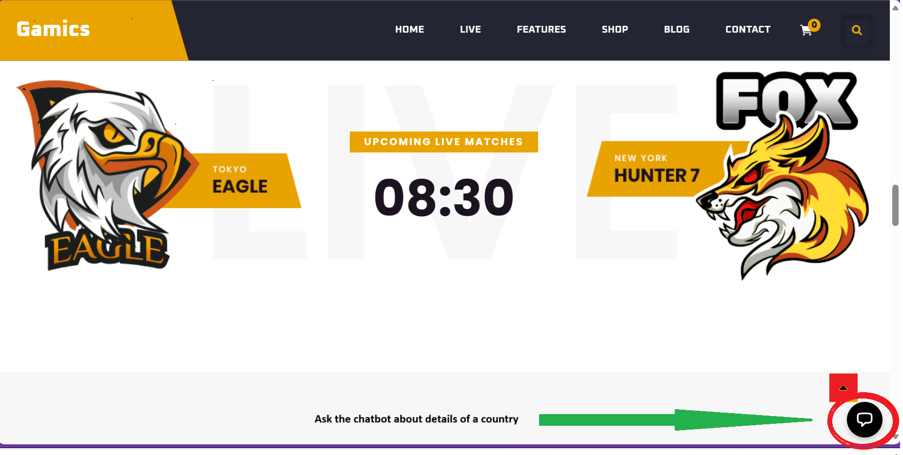
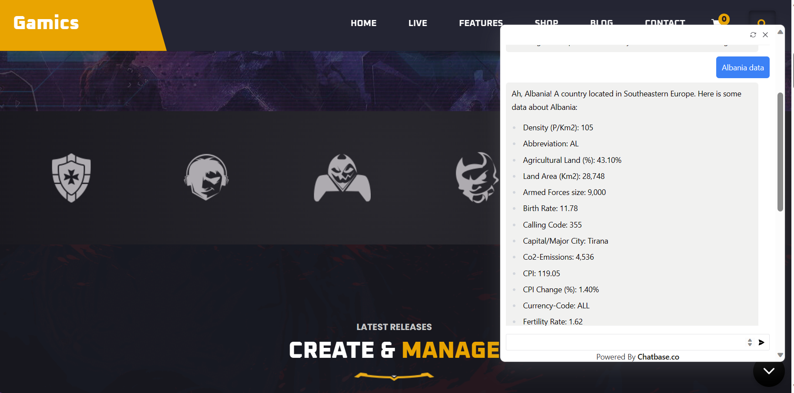

<div align = "center"> 
<h1 align="center">AI chatbot integrated website</h1>

<div align = "left">
I only have integrated a chatbot to this beautiful website👀
<br>
I haven't made this website only used it to integrate a chatbot
<h4><b>Credit to the real owner to this website.</b></h3>
<h4><b>Credit :- codewithsadee </b></h3>
</div>

<h3>Ask the chatbot about any country of the world </h3>
<h2><a href="https://rik-21.github.io/ChatBotintegratedwebsite.github.io/"><strong>➥ Live Demo</strong></a></h2>
</div>

### Demo Screeshots of the Chatbot






<br>
<br>
<br>
<br>
<br>
<br>
<div align="center">
  
  
  
  
  [](https://twitter.com/intent/follow?screen_name=codewithsadee)
  [](https://youtu.be/VJKx9uLEpaU)

  <br />
  <br />

  <h2 align="center">Gamics - Gaming website</h2>

  Gamics is a fully responsive gaming website, <br />Responsive for all devices, build using HTML, CSS, and JavaScript.

  <a href="https://codewithsadee.github.io/gamics/"><strong>➥ Live Demo</strong></a>

</div>

<br />

### Demo Screeshots


### Prerequisites

Before you begin, ensure you have met the following requirements:

* [Git](https://git-scm.com/downloads "Download Git") must be installed on your operating system.

### Run Locally

To run **Gamics** locally, run this command on your git bash:

Linux and macOS:

```bash
sudo git clone https://github.com/codewithsadee/gamics.git
```

Windows:

```bash
git clone https://github.com/codewithsadee/gamics.git
```

### Contact

If you want to contact with me you can reach me at [Twitter](https://www.twitter.com/codewithsadee).

### License

This project is **free to use** and does not contains any license.
